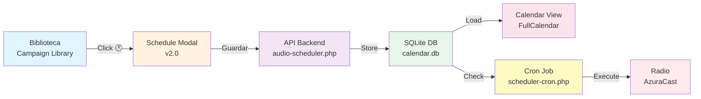

# 📅 Sistema de Scheduling de Audio MBI-v3 [ACTUALIZADO]
**Programación Automatizada de Reproducción de Audio en Radio**

> **Última actualización:** 2025-08-27  
> **Versión:** 2.0 - Con sistema de categorías  
> **Estado:** ✅ En producción - Cron activo cada minuto

---

## 📋 Tabla de Contenidos
1. [Visión General](#visión-general)
2. [Arquitectura del Sistema](#arquitectura-del-sistema)
3. [Flujo de Trabajo Completo](#flujo-de-trabajo-completo)
4. [Sistema de Categorías v2.0](#sistema-de-categorías-v20)
5. [Tipos de Programación](#tipos-de-programación)
6. [Base de Datos](#base-de-datos)
7. [APIs y Endpoints](#apis-y-endpoints)
8. [Integración con Calendario](#integración-con-calendario)
9. [Sistema Cron](#sistema-cron)
10. [Archivos Críticos](#archivos-críticos)
11. [Logs y Monitoreo](#logs-y-monitoreo)
12. [Guía de Uso](#guía-de-uso)

---

## 🎯 Visión General

El sistema de scheduling permite programar la reproducción automática de audios en la radio del mall. Los usuarios pueden crear programaciones desde la biblioteca de campañas, configurarlas mediante un modal intuitivo, y visualizarlas en el calendario con colores según su categoría.

### Características Principales
- **3 tipos de programación**: Intervalo, días específicos, una sola vez
- **Sistema de categorías** con colores y emojis distintivos
- **Integración completa** con calendario visual
- **Cron job activo** ejecutándose cada minuto
- **Logs detallados** de todas las ejecuciones
- **Preview de audio** desde el calendario

---

## 🏗️ Arquitectura del Sistema

### Flujo Principal: Biblioteca → Programación → Calendario → Ejecución



---

## 📊 Flujo de Trabajo Completo

### 1. **Creación de Schedule (Biblioteca → Modal)**

```javascript
// modules/campaign-library/index.js (línea ~608)
async scheduleMessage(id, title) {
    const message = this.messages.find(m => m.id === id);
    
    // Cargar modal dinámicamente si no existe
    if (!window.ScheduleModal) {
        const module = await import('./schedule-modal.js');
        window.ScheduleModal = module.ScheduleModal;
    }
    
    // Crear y mostrar modal con categoría
    window.scheduleModal = new window.ScheduleModal();
    modal.show(message.filename, title, message.category); // v2.0: incluye categoría
}
```

### 2. **Configuración del Schedule (Modal)**

El modal (`schedule-modal.js`) ofrece 3 tipos de programación:

#### Tipos de Schedule:
- **`interval`**: Repetición por tiempo (cada X horas/minutos)
- **`specific`**: Días específicos + horas múltiples
- **`once`**: Una sola vez en fecha y hora específica

### 3. **Guardado en Backend**

```javascript
// schedule-modal.js → audio-scheduler.php
POST /api/audio-scheduler.php
{
    action: 'create',
    filename: 'tts20250818153913.mp3',
    title: 'Mensaje de ofertas',
    category: 'ofertas',              // NUEVO v2.0
    schedule_type: 'specific',
    schedule_days: ['friday', 'saturday'],
    schedule_times: ['14:00', '18:00'],
    start_date: '2025-08-21',
    end_date: '2025-12-31'
}
```

### 4. **Almacenamiento en Base de Datos**

```sql
-- Tabla: audio_schedule
INSERT INTO audio_schedule (
    filename, title, category, schedule_time, schedule_days,
    start_date, end_date, is_active, notes
) VALUES (
    'tts20250818153913.mp3',
    'Mensaje de ofertas',
    'ofertas',                           -- Campo categoría v2.0
    '["14:00","18:00"]',                -- JSON array de horas
    '["friday","saturday"]',             -- JSON array de días
    '2025-08-21',
    '2025-12-31',
    1,
    '{"type":"specific","notes":"Ofertas fin de semana"}'
);
```

### 5. **Carga en Calendario**

```javascript
// modules/calendar/components/calendar-view.js
async loadAudioSchedules() {
    const response = await fetch('/api/audio-scheduler.php', {action: 'list'});
    const schedules = response.schedules;
    
    // Transformar schedules en eventos de FullCalendar
    schedules.forEach(schedule => {
        const event = {
            id: `audio_schedule_${schedule.id}`,
            title: getCategoryEmoji(schedule.category) + ' ' + schedule.title,
            backgroundColor: getCategoryColor(schedule.category),
            extendedProps: {
                type: 'audio_schedule',
                category: schedule.category,
                filename: schedule.filename
            }
        };
        calendar.addEvent(event);
    });
}
```

---

## 🎨 Sistema de Categorías v2.0

### Categorías Disponibles

| Categoría | Emoji | Color Fondo | Color Texto | Uso |
|-----------|-------|-------------|-------------|-----|
| **ofertas** | 🛍️ | Verde claro | #22c55e | Promociones y descuentos |
| **eventos** | 🎉 | Azul claro | #3b82f6 | Eventos del mall |
| **informacion** | 📢 | Cyan claro | #06b6d4 | Información general |
| **emergencias** | 🚨 | Rojo claro | #ef4444 | Avisos urgentes |
| **servicios** | 🛠️ | Púrpura claro | #a855f7 | Servicios del mall |
| **horarios** | 🕐 | Naranja claro | #f59e0b | Cambios de horario |
| **sin_categoria** | 📝 | Gris claro | #6b7280 | Sin categorizar |

### Implementación Visual

```javascript
// modules/campaign-library/schedule-modal.js
const categoryColors = {
    ofertas: { emoji: '🛍️', bg: 'rgba(34, 197, 94, 0.2)', text: '#22c55e' },
    eventos: { emoji: '🎉', bg: 'rgba(59, 130, 246, 0.2)', text: '#3b82f6' },
    informacion: { emoji: '📢', bg: 'rgba(6, 182, 212, 0.2)', text: '#06b6d4' },
    emergencias: { emoji: '🚨', bg: 'rgba(239, 68, 68, 0.2)', text: '#ef4444' },
    servicios: { emoji: '🛠️', bg: 'rgba(168, 85, 247, 0.2)', text: '#a855f7' },
    horarios: { emoji: '🕐', bg: 'rgba(245, 158, 11, 0.2)', text: '#f59e0b' },
    sin_categoria: { emoji: '📝', bg: 'rgba(107, 114, 128, 0.2)', text: '#6b7280' }
};
```

---

## ⏰ Tipos de Programación

### 1. **Interval (Repetición por Tiempo)**
```javascript
{
    schedule_type: 'interval',
    interval_hours: 2,
    interval_minutes: 30,
    start_date: '2025-08-27',
    end_date: '2025-12-31'
}
// Ejecuta cada 2 horas y 30 minutos
```

### 2. **Specific (Días y Horas Específicas)**
```javascript
{
    schedule_type: 'specific',
    schedule_days: ['monday', 'wednesday', 'friday'],
    schedule_times: ['09:00', '14:00', '18:00'],
    start_date: '2025-08-27',
    end_date: '2025-12-31'
}
// Ejecuta Lun/Mié/Vie a las 9:00, 14:00 y 18:00
```

### 3. **Once (Una Sola Vez)**
```javascript
{
    schedule_type: 'once',
    once_datetime: '2025-08-30T15:30',
    start_date: '2025-08-30',
    schedule_times: ['15:30']
}
// Ejecuta una sola vez el 30/08 a las 15:30
```

---

## 💾 Base de Datos

### Ubicación
```
/calendario/api/db/calendar.db
```

### Estructura de Tabla `audio_schedule`

```sql
CREATE TABLE audio_schedule (
    id INTEGER PRIMARY KEY AUTOINCREMENT,
    filename TEXT NOT NULL,
    title TEXT NOT NULL,
    category TEXT DEFAULT 'sin_categoria',    -- v2.0
    
    schedule_time TEXT NOT NULL,              -- JSON array o tiempo único
    schedule_days TEXT DEFAULT 'daily',       -- JSON array de días
    start_date DATE,
    end_date DATE,
    
    is_active BOOLEAN DEFAULT 1,
    priority INTEGER DEFAULT 5,
    
    created_at DATETIME DEFAULT CURRENT_TIMESTAMP,
    updated_at DATETIME DEFAULT CURRENT_TIMESTAMP,
    created_by TEXT,
    notes TEXT                                -- JSON con metadata
);

-- Índices para optimización
CREATE INDEX idx_schedule_time ON audio_schedule(schedule_time, is_active);
CREATE INDEX idx_schedule_active ON audio_schedule(is_active, priority);
CREATE INDEX idx_audio_schedule_category ON audio_schedule(category, is_active);
```

### Formato de Datos

- **schedule_days**: JSON array → `["monday","wednesday","friday"]`
- **schedule_time**: JSON array → `["09:00","14:00","18:00"]`
- **notes**: JSON object → `{"type":"specific","interval_hours":null,"notes":"Texto libre"}`
- **category**: String → `"ofertas"`, `"eventos"`, etc.

---

## 🔌 APIs y Endpoints

### `/api/audio-scheduler.php`

#### Acciones Disponibles

| Acción | Método | Descripción | Parámetros |
|--------|--------|-------------|------------|
| `create` | POST | Crear nueva programación | filename, title, category, schedule_type, etc. |
| `list` | POST | Listar programaciones activas | active_only (boolean) |
| `delete` | POST | Eliminar programación | id |
| `update` | POST | Actualizar programación | id, campos a actualizar |
| `check_execute` | POST | Verificar schedules a ejecutar | - |
| `log_execution` | POST | Registrar ejecución | schedule_id, status, message |

#### Ejemplo de Response (list)
```json
{
    "success": true,
    "schedules": [
        {
            "id": 1,
            "filename": "tts20250818153913.mp3",
            "title": "Ofertas de temporada",
            "category": "ofertas",
            "schedule_type": "specific",
            "schedule_days": ["friday", "saturday"],
            "schedule_times": ["14:00", "18:00"],
            "is_active": 1
        }
    ],
    "total": 1,
    "categories": {
        "ofertas": {"total": 5, "activos": 3},
        "eventos": {"total": 2, "activos": 2}
    }
}
```

### `/api/biblioteca.php`

| Endpoint | Descripción |
|----------|-------------|
| `GET ?filename=X` | Streaming de audio para preview |
| `POST list_library` | Listar archivos disponibles |
| `POST send_library_to_radio` | Enviar archivo a radio |

---

## 📅 Integración con Calendario

### Componente Principal: `calendar-view.js`

#### Carga de Schedules
```javascript
// Línea ~322
async loadAudioSchedules() {
    const response = await fetch('/api/audio-scheduler.php', {
        method: 'POST',
        body: JSON.stringify({ action: 'list' })
    });
    
    const data = await response.json();
    const schedules = data.schedules;
    
    // Transformar a eventos de calendario
    return this.transformSchedulesToEvents(schedules);
}
```

#### Cálculo de Próximas Ejecuciones
```javascript
// Línea ~380-500
calculateNextExecution(schedule) {
    switch(schedule.schedule_type) {
        case 'interval':
            // Calcula próxima ejecución basada en intervalos
            break;
        case 'specific':
            // Busca próximo día/hora que coincida
            break;
        case 'once':
            // Retorna la fecha única configurada
            break;
    }
}
```

### Eventos en Calendario

Cada schedule puede generar múltiples eventos en el calendario:
- **Interval**: Un evento por cada ejecución en los próximos 7 días
- **Specific**: Un evento por cada día/hora configurado
- **Once**: Un único evento en la fecha especificada

---

## ⚙️ Sistema Cron

### Configuración del Cron Job

```bash
# Ejecutar cada minuto
* * * * * /usr/bin/php /var/www/mbi-v3/api/scheduler-cron.php
```

### Script: `scheduler-cron.php`

#### Flujo de Ejecución
1. **Conecta** con la base de datos SQLite
2. **Consulta** schedules activos via API (`check_execute`)
3. **Verifica** cuáles deben ejecutarse ahora
4. **Envía** audio a la radio via `generate.php`
5. **Registra** ejecución en logs
6. **Actualiza** estado via API (`log_execution`)

#### Configuración
```php
// Zona horaria
date_default_timezone_set('America/Santiago');

// Paths
$dbPath = __DIR__ . '/../calendario/api/db/calendar.db';
$logFile = __DIR__ . '/logs/scheduler-' . date('Y-m-d') . '.log';

// Endpoint interno
$apiUrl = 'http://localhost:3000/api/audio-scheduler.php';
```

---

## 📁 Archivos Críticos

### Frontend
```
/modules/
├── campaign-library/
│   ├── index.js                    # Biblioteca - botón schedule (línea ~608)
│   ├── schedule-modal.js           # Modal de configuración v2.0
│   └── plugins/
│       └── scheduler-plugin.js     # Plugin de scheduling
├── calendar/
│   ├── index.js                    # Controlador del calendario
│   └── components/
│       └── calendar-view.js        # Vista y cálculo de eventos (línea 322-500)
```

### Backend
```
/api/
├── audio-scheduler.php             # CRUD de schedules con categorías
├── scheduler-cron.php              # Script cron (ejecuta cada minuto)
├── biblioteca.php                  # Gestión de archivos MP3
└── logs/
    └── scheduler-YYYY-MM-DD.log    # Logs diarios de ejecución

/calendario/api/
└── db/
    └── calendar.db                 # Base de datos SQLite
```

---

## 📊 Logs y Monitoreo

### Ubicación de Logs
```
/api/logs/scheduler-2025-08-27.log
```

### Formato de Log
```
[2025-08-27 15:17:01] === Iniciando verificación de programaciones ===
[2025-08-27 15:17:01] Encontradas 2 programaciones para ejecutar
[2025-08-27 15:17:01] Ejecutando: Ofertas especiales (tts20250827151700.mp3)
[2025-08-27 15:17:02] ✅ Ejecutado exitosamente: tts20250827151700.mp3
[2025-08-27 15:17:02] === Verificación completada ===
```

### Estados de Ejecución
- **✅ Success**: Audio enviado correctamente a la radio
- **❌ Failed**: Error al enviar (archivo no encontrado, API down, etc.)
- **⏭️ Skipped**: Schedule inactivo o fuera de rango de fechas

### Monitoreo Activo

El cron se ejecuta cada minuto, generando aproximadamente:
- **1,440 verificaciones/día**
- **~290KB de logs/día**
- Rotación automática de logs por fecha

---

## 📖 Guía de Uso

### Crear una Programación

1. **Ir a Biblioteca** → Módulo Campaign Library
2. **Buscar el audio** que deseas programar
3. **Click en 🕐** (botón Programar)
4. **Configurar en el modal**:
   - Seleccionar tipo (interval/specific/once)
   - Configurar días/horas según el tipo
   - Establecer fechas de inicio/fin
   - Agregar notas opcionales
5. **Guardar** → Se crea el schedule
6. **Ver en calendario** → Aparece con color de categoría

### Ver Programaciones en Calendario

1. **Ir al Calendario** → Módulo Calendar
2. **Los schedules aparecen** con:
   - Emoji de categoría
   - Color distintivo
   - Título del audio
3. **Click en evento** para:
   - Ver detalles
   - Preview del audio
   - Eliminar programación

### Verificar Ejecución

1. **Revisar logs**:
   ```bash
   tail -f /api/logs/scheduler-$(date +%Y-%m-%d).log
   ```
2. **Ver schedules activos**:
   ```bash
   sqlite3 /calendario/api/db/calendar.db \
   "SELECT * FROM audio_schedule WHERE is_active=1"
   ```

---

## 🚀 Mejoras Pendientes

### Inmediatas
- [ ] **Editar Schedule**: Implementar modo edición en modal
- [ ] **Validación de archivos**: Verificar que existen antes de programar
- [ ] **Notificaciones**: Alertas cuando se ejecuta un schedule

### Futuras
- [ ] **Dashboard de schedules**: Vista dedicada con estadísticas
- [ ] **Prioridades avanzadas**: Sistema de prioridades para conflictos
- [ ] **Templates de scheduling**: Guardar configuraciones frecuentes
- [ ] **API REST completa**: Endpoints públicos para integración externa
- [ ] **Reportes**: Historial de ejecuciones y estadísticas

---

## 🔒 Consideraciones de Seguridad

- **Validación de archivos**: Solo se pueden programar archivos existentes
- **Permisos**: Requiere acceso al módulo de biblioteca
- **Sanitización**: Todos los inputs son sanitizados en PHP
- **Logs**: Registro completo de todas las operaciones
- **Backup de DB**: Múltiples backups con timestamp

---

## 📝 Notas Técnicas

### Compatibilidad
- **Sin optional chaining** (`?.`) para navegadores antiguos
- **Sin spread operator** (`...`) en loops críticos
- **Loops tradicionales** en lugar de `.map().filter()`

### Timezone
- Configurado para **America/Santiago** (Chile)
- Ajuste automático de UTC-4
- Todos los schedules en hora local

### Performance
- Cálculo de eventos limitado a **7 días** para evitar sobrecarga
- Índices en base de datos para queries rápidas
- Cache de eventos en calendario

---

*Esta documentación refleja el estado actual del Sistema de Scheduling v2.0 con soporte completo de categorías.*